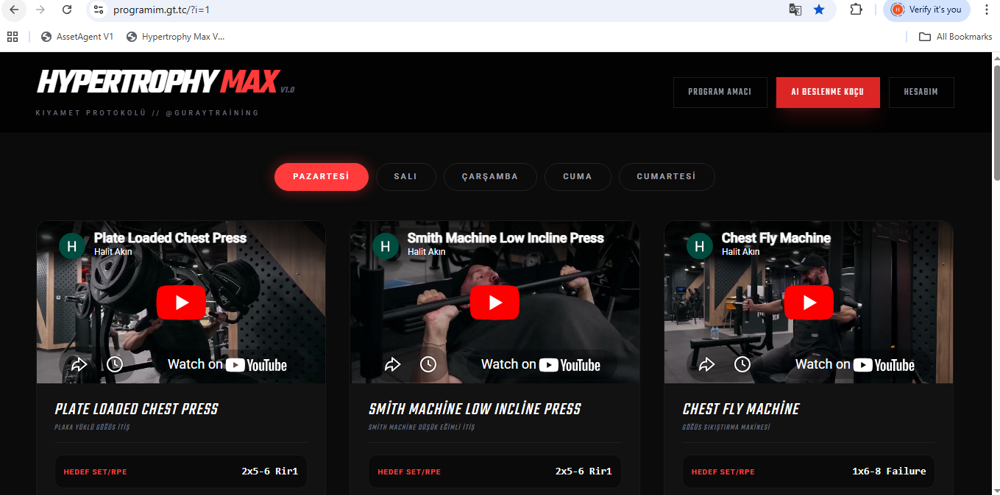

# Hypertrophy Max — Elite AI-Powered Fitness Protocol



Hypertrophy Max is an advanced performance platform engineered for serious athletes. It leverages the **Guray Training Protocol** combined with **Cerebras Llama 3.1 AI** to deliver hyper-personalized nutrition strategies, real-time competitive knowledge arenas, and comprehensive biometric tracking in a high-performance dark-mode interface.

---

## ⚡ Core Intelligence Modules

### 🧠 AI Nutrition Intelligence (Cerebras Core)
Generate 7-day tactical nutrition plans in milliseconds. The system adapts to your specific metabolic needs, goals, and even your budget.
- **Biometric Profiling**: Tailored macros based on current form, age, and activity.
- **Differentiated Tracks**: Specific algorithms for **Naturel** vs. **Anabolic** protocols.
- **Economic Optimization**: Specialized meal plans ranging from "Student/Budget" to "Premium/Elite" profiles.


### 🏆 Elite Arena (PvP Knowledge Duel)
Knowledge is power. Compete against other athletes in a real-time, high-stakes fitness quiz arena.
- **Real-time HUD**: Monitor your opponent's question progress and score live.
- **Dynamic Question Sets**: AI-generated questions covering anatomy, nutrition, and training science.


### 🤝 Community Hub & Messaging
A dedicated social space for elite training partners to communicate and challenge each other.
- **Live Chat**: Instant communication with the fitness community.
- **Arena Invites**: Instant matchmaking via the integrated lightning-bolt challenge system.


### 📊 Biometric Analytics
Data-driven progress tracking for body measurements, weight, and nutrition history.
- **Visual Progress**: Dynamic tracking of measurements to ensure consistent **Progressive Overload**.
- **Historical Logs**: Comprehensive records of past AI-generated plans and body metrics.


---

## 🛠️ Technical Architecture

| Layer | Technology |
| :--- | :--- |
| **Logic** | PHP 8.x (Secure Backend Proxying) |
| **Intelligence** | Cerebras Inference (Llama 3.1 8B Instruct) |
| **UI Framework** | TailwindCSS (Ultra-Modern Glassmorphism) |
| **Database** | MySQL (Relational Data Persistence) |
| **Export** | HTML2PDF.js (Tactical PDF Generation) |

---

## 🚀 Quick Start & Installation

1.  **Clone Repository**:
    ```bash
    git clone https://github.com/akin-34/Hypertrophy-Max.git
    ```
2.  **Configuration**:
    - Rename `htdocs/config.sample.php` to `config.php`.
    - Insert your **Cerebras API Key** and MySQL credentials.
3.  **Database Migration**:
    - Import the included SQL file into your local or production database.
4.  **Launch**:
    - Deploy to any Apache/PHP web server environment.

---

> [!IMPORTANT]
> This system is designed for high-performance tracking. Every set, every gram, and every line of code is optimized for maximum efficiency. **Elite Results require Elite Data.** 💪🔥
